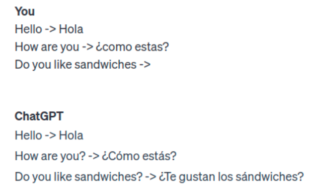
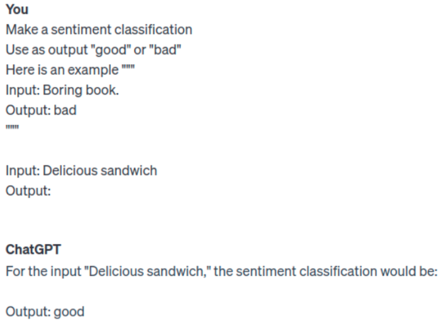
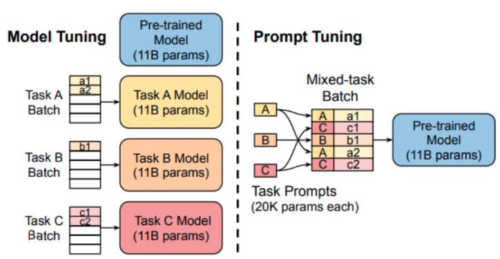
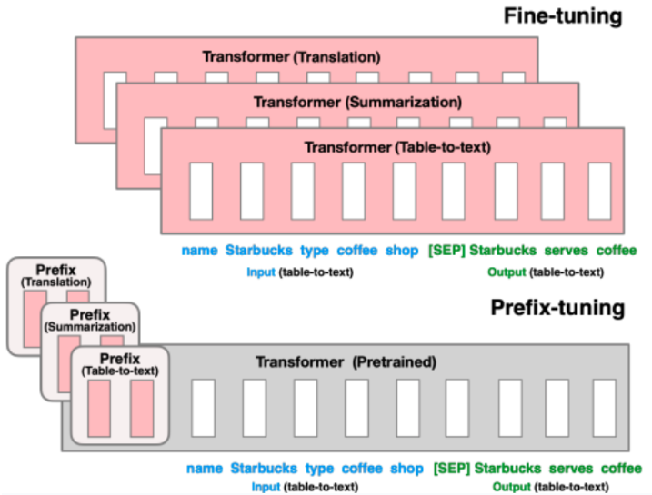

In recent years, the field of natural language processing (NLP) has witnessed significant advancements, largely driven by the development of sophisticated language models like GPT-3.5 and GPT-4. Amidst these developments, _prompting_ has emerged as a powerful technique. Unlike traditional model training, prompting involves the strategic crafting of input prompts to steer a language model’s response in a desired direction. This method exploits the pre-trained knowledge of the model, enabling it to generate outputs that are more aligned with specific tasks, without the need for extensive retraining.

In the following sections, we delve into the details of prompting, exploring its definition, benefits and explaining why you should know this technique.

# Prompting

The development of large pre-trained language models has traditionally been a resource-intensive process, demanding substantial time and computational power. With the increasing scale of these models, the field has shifted its focus toward more resource-efficient methods of model adaptation, such as prompting techniques. Prompting leverages a pre-trained model across a variety of tasks without altering the underlying model architecture. Instead, it employs text prompts that either articulate the nature of the task at hand or provide a task-specific example. This strategy enables the application of a singular model across diverse tasks, drastically reducing the need for extensive training and storage. In the world of prompting, there are two main ways of crafting a prompt.

## Hard prompts

Hard prompts are human-crafted text prompts with discrete input tokens. These types of prompts are typically engineered by a human to solve a specific task. Let's say you want your pre-trained LLM to function as a translator from English to Spanish. You can create a template prompt with a few examples representing the translation from English to Spanish and leave the last sentence empty. The model will provide the translation for the last sentence.

Every element within the prompt, including not only human-readable text but also operators and line breaks, are important and will affect the outcome of the model. Adjusting each of these components is essential to creating a good prompt.

Another example could be that you want your LLM to solve a simple sentiment classification like the following:

- Input: “boring book”, “delicious sandwich”
- Output: “good” or “bad”

With hard prompts, this could be done like this:

While this technique is manageable for simpler tasks, the complexity and effort required to create a good prompt increases substantially as the problem becomes more intricate. This is a significant drawback of hard prompting. In some cases, it might even be needed to create a series of prompts to achieve the desired outcome. This is where the second technique comes in, the so-called soft prompts.

## Soft prompts

Soft prompts are AI-designed prompts that consist of [embedding](https://learn.microsoft.com/en-us/semantic-kernel/memories/embeddings). They can be explained as strings of numbers, these embeddings distill knowledge from the pre-trained model. These soft prompts are trainable and are highly efficient in guiding the model to the desired output.

The biggest downside of soft prompts is that they aren’t human-readable. The AI may discover a prompt optimized for a given task but can't explain why it chose those embeddings.

Several soft prompt methods have appeared in recent years. In this article, we would like to discuss the methods included in prompt tuning and prefix tuning.

# Prompt Tuning

At its core, prompt tuning is a method of influencing the behavior of a language model by carefully designing the input prompt. The concept relies on the idea that these language models, already trained on vast datasets, have developed a deep understanding of language patterns and knowledge.

Prompt tuning is more about 'teaching' the model how to apply its existing knowledge in a new context. It does not alter the model's weights; instead, it changes how the model interprets and responds to inputs.

With this method, you only need to train a small set of prompt embeddings which can then specialize your model in a specific task. This is way more efficient than having to train different models for each task.

To make this clear let’s take our sentiment classification example. LLMs are good at filling out blanks and predicting the next words. So prompt tuning converts the classification problem into a next-word prediction use case where ‘it was’ has been added to the prompt:

- Input: delicious sandwich. It was _MASK_
- Output: “good” or “bad”

Then the last step is to predict the word for _MASK_, this is a relatively simple task for a pre-trained LLM. It is crucial to understand that the addition of “It was” is due to the embeddings that learned to guide the model’s behavior by manipulating the initial prompt. The resulting prompt is the result of the learning process of these embeddings. Also, this is a very simple example and more complex ones are more or less a black box. Through an iterative process, the AI learns through the prompt embeddings how to adjust its initial prompt to get the desired output.

# Prefix Tuning

Prefix tuning is another approach for adapting language models to specific tasks. Similar to prompt tuning, it aims to leverage the pre-existing knowledge in a language model, but it does this by appending a sequence of tunable vectors to the input sequence. These vectors are learned embeddings that can influence the model's behavior.

In prefix tuning, a set of continuous vectors is optimized during training. These vectors, or prefixes, are prepended to the input sequence, effectively serving as a kind of learned context that guides the model's responses. The model itself remains frozen, so only the prefixes are optimized, which is a much smaller subset of parameters compared to the entire model.

# Prompt Tuning vs. Prefix Tuning

Both techniques were developed independently at about the same time. Therefore, there are no benchmarks in the papers against which to compare them. According to this [paper](https://zwcolin.github.io/pdfs/dsc180.pdf) Prefix tuning generally performs better in-domain, but may not generalize well to out-of-domain data compared to prompt tuning. Although prefix tuning modifies more layers and uses more memory, it's efficient at adapting to specific tasks with more parameters. Prompt tuning, with fewer parameters, is more memory efficient, making it suitable for limited resources despite potentially poorer in-domain performance.

Use prompt tuning if you need a memory efficient approach and your task involves dealing with data from different domains, as it offers better domain robustness. Choose Prefix Tuning if you have the computing resources and are focused on achieving the best performance within a specific domain, as it will generally perform better on in-domain data.

# What we've learned

Prefix and prompt tuning are methods used to steer the output of large language models. They are handy for adapting models to specific tasks.

**Efficiency in Parameter Tuning**: Both prefix and prompt tuning add a small set of trainable parameters to a fixed, pre-trained model. This is more parameter-efficient compared to full model fine-tuning, where every parameter of the model is updated. This efficiency makes these methods appealing when computational resources are limited.

**Task-Specific Customization**: These methods allow for the customization of language models for specific tasks or domains without needing to retrain the entire model.

**Preserving Pre-Trained Knowledge**: Since the bulk of the model's parameters remains unchanged, the knowledge captured during the original, extensive pre-training is preserved. This is beneficial as it ensures that the model retains its general language understanding abilities while adapting to new tasks.

In conclusion, the appeal of prompt tuning and prefix tuning lies in their efficiency, flexibility, and the ability to leverage the vast pre-trained knowledge of models. By adding only a small set of trainable parameters, these methods offer a more resource-efficient way to customize these powerful models for specific tasks or domains.

Their use also underscores a crucial shift in machine learning approaches - from models that need extensive retraining to adaptable systems that can apply their vast preexisting knowledge to new scenarios with minimal adjustments.
